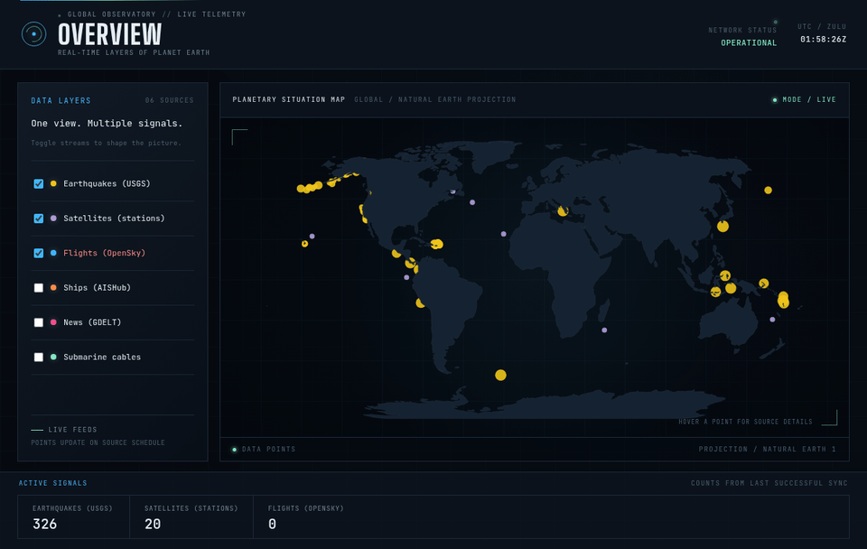
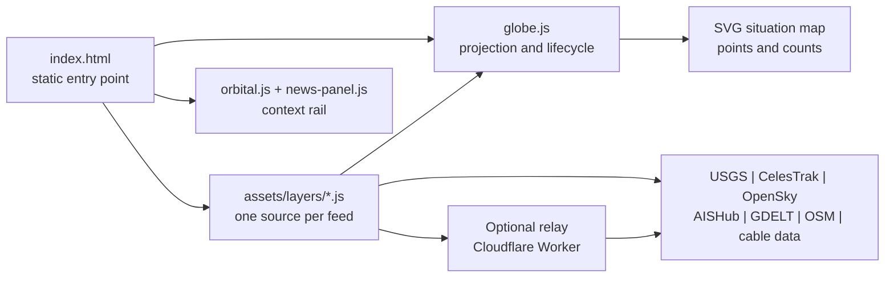
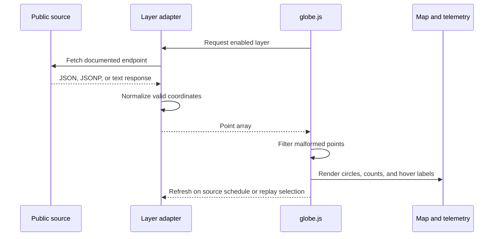
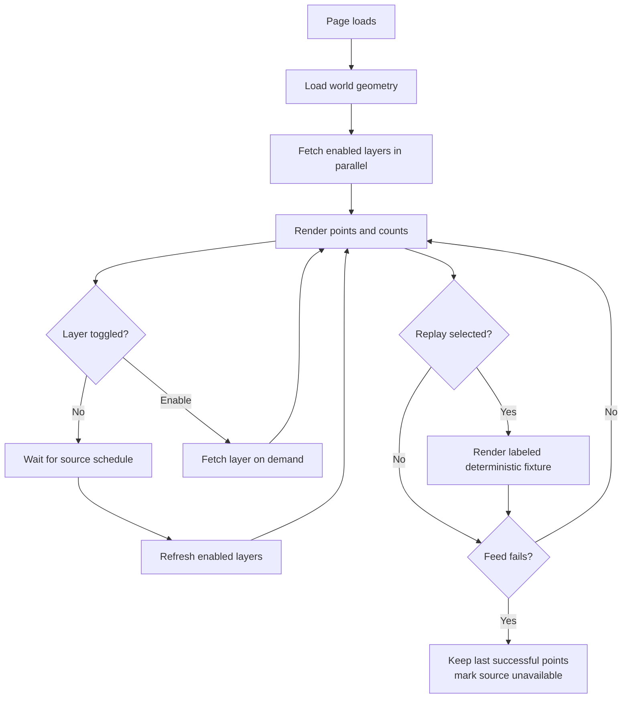

<div align="center">

# OVERVIEW

### A live planetary intelligence console for the open web.

One dark, readable surface for earthquakes, satellites, aircraft, ships, news signals, and submarine cables.

<p>
  <a href="https://maprestore.github.io/overview-earth/"></a>
  <a href="#run-locally"></a>
  <a href="LICENSE"></a>
</p>

<a href="https://maprestore.github.io/overview-earth/">
  
</a>

<sub>Recorded from the public deployment. The Earthquakes layer is toggled while the live UTC clock advances.</sub>

</div>

## The Idea

Data is everywhere. The hard part is making it legible.

Overview turns documented public feeds into a calm, high-signal situation room. Enable only the streams you need, see where signals cluster, and inspect the source behind every point. It is intentionally small enough to understand, fork, and extend in an afternoon.

> The map is a live visual index, not a data warehouse. Each point is either a current observation or a clearly labeled source-derived location.

## What You Get

| Surface | What it does |
|---|---|
| Situation map | Natural Earth projection with source-colored points, hover labels, counts, independent refresh schedules, zoom, pan, and clustering. |
| Command deck | Focus the map by region, search loaded signals, switch source-window context, manually sync active feeds, and export the current source-aware snapshot as JSON. |
| Data layer rail | Toggle seven source adapters without restarting the page or waiting for optional feeds. |
| Orbital context | A Three.js Earth, orbit ring, stars, and visual satellite markers that explain the signal surface at a glance. It is explicitly not a measured position tracker. |
| Signal Brief | An opt-in GDELT article panel with source, time, domain, and safe outbound links. |
| Story Mode | One-click views for a live baseline, impact signals, infrastructure, or the built world. Each view is a shareable URL. |
| Replay fixture | Open a deterministic, clearly labeled scene when you need a reliable demo without pretending it is live. |
| Live tour | A 30-second guided run through the strongest views, designed for demos and first-time visitors. |
| Today's Brief | A computed summary of the largest loaded earthquake, visible orbital objects, and current feed posture. |
| Activity pulse | A compact 24-hour histogram derived from the timestamps in the loaded USGS earthquake feed. |
| Source-aware status | Feed failures stay local. The console tells you when a source is unavailable instead of pretending everything is live. |
| Signal inspector | Persistent metadata, source links, coordinates, timestamps, and a local watchlist that works with mouse, touch, and keyboard input. |
| Local history | IndexedDB retains up to seven days of observations collected by the current browser for source-bounded historical views. |
| Mission console | Ask deterministic natural-language-style questions, jump to a region, isolate seismic anomalies, scrub recorded observations, and surface proximity-based cross-source fusion cards. |
| Evidence briefs | Turn a selected point into a downloadable, source-traceable incident brief with nearby observations clearly labeled as context rather than causality. |
| Mission capsules | Copy a URL that preserves the active mission query, filters, anomaly mode, and time cursor for handoff or review. |
| Local alert rules | Arm simple threshold rules in the browser and see matches on the latest loaded points. These rules are local and do not send server-side notifications. |
| Baseline compare | Expand a source-by-source comparison against the seven-day browser-collected average when history exists. Missing history is labeled instead of guessed. |
| Responsive console | The same situation-room language works on desktop and mobile without a build pipeline. |

## The First Thirty Seconds

Overview is designed to make the first interaction obvious:

1. **Run the live tour.** Let the console move through baseline, impact, and infrastructure views.
2. **Choose a field guide.** Or take control with Live Baseline, Impact Map, or Infrastructure.
3. **Read the brief.** The summary and 24-hour pulse are computed from the feeds that actually loaded.
4. **Inspect a signal.** Click or focus a point to keep its source, coordinates, timestamp, and watch controls visible.
5. **Trust the status.** Every layer exposes standby, syncing, live, fallback, replay, or unavailable state.
6. **Try Built World.** See live OpenStreetMap building footprints and directional aircraft glyphs instead of generic dots.
7. **Share the view.** Copy the current URL and send someone the exact same layer selection, filters, or replay state.
8. **Use the command deck.** Focus a region, find a loaded signal by label, or export the current observations for further analysis.
9. **Open Mission Console.** Try “strong earthquakes near Japan,” scrub the Time Machine, or open an evidence brief from a fused signal.

## Built For

| Audience | First useful moment |
|---|---|
| Researchers | Compare independent public feeds without opening six separate dashboards. |
| Journalists | Start from a visible signal, inspect its source, and keep the access caveat attached. |
| Operations teams | Use the baseline and infrastructure views as a fast global orientation surface. |
| Builders | Add a source adapter without adopting a framework, build system, or backend. |
| Curious humans | See how earthquakes, orbit, air traffic, news, and connectivity share one planet. |

## Open Core, Paid Expansion

The public repository proves the core experience. A hosted product can create value around the operational work that static pages cannot provide:

| Hosted capability | Why it belongs in a paid product |
|---|---|
| Managed provider relays | Keep OpenSky and AISHub access browser-safe without asking every customer to operate infrastructure. |
| Historical archive and replay | Compare today's signals with previous days, events, and customer-defined time windows. |
| Alerts and watchlists | Notify a team when a source, region, or threshold changes. |
| Saved workspaces | Preserve views, layer settings, source credentials, and team permissions. |
| Reliability and support | Add uptime targets, source monitoring, audit logs, and a clear support path. |

The open version stays useful on its own. The paid version earns its place by removing operational friction and adding durable history, collaboration, and guarantees.

## Live Layers

The core contract is deliberately boring: every adapter returns `{ lat, lon, size, label }`, with an optional `line` route or `lines` segments for sources that have geometry. A source may wrap the point array as `{ points, source, fallback }` when fallback provenance matters. The engine handles validation, scheduling, rendering, toggles, counts, freshness, and graceful failure. Source-specific parsing stays inside the adapter that understands it.

| Layer | Status | Source | What appears on the map |
|---|---|---|---|
| Earthquakes | Live | [USGS](https://earthquake.usgs.gov/earthquakes/feed/v1.0/summary/) | Events from the last 24 hours, sized by magnitude. [Feed](https://earthquake.usgs.gov/earthquakes/feed/v1.0/summary/all_day.geojson) |
| Satellites | Live | [CelesTrak](https://celestrak.org/) | Current positions for the stations group, propagated from TLE data with satellite.js. [Feed](https://celestrak.org/NORAD/elements/gp.php?GROUP=stations&FORMAT=tle) |
| Flights | Live via relay, direct access constrained | [OpenSky Network](https://openskynetwork.github.io/opensky-api/) | Normalized aircraft state vectors through the optional server-side relay, with direct and regional fallbacks. [Endpoint](https://opensky-network.org/api/states/all) |
| Ships | Opt-in / relay required | [AISHub](https://www.aishub.net/) | AIS positions through the optional `relay/ships-worker.js` relay; local direct access remains available only for testing. |
| News | Experimental | [GDELT DOC 2.0](https://www.gdeltproject.org/) | Reporting-country centroids and article metadata for a 24-hour query. [Query](https://api.gdeltproject.org/api/v2/doc/doc?query=conflict%20OR%20crisis%20OR%20protest%20OR%20disaster&mode=artlist&format=json&maxrecords=100&timespan=24h&sort=datedesc) |
| Submarine cables | Live with route view | [TeleGeography](https://www.submarinecablemap.com/) and [FAO mirror](https://data.apps.fao.org/) | Route lines and midpoints from the primary endpoint, with a browser-compatible open-data fallback. |
| Buildings | Live map extracts | [OpenStreetMap](https://www.openstreetmap.org/) map API and [Overpass](https://overpass-api.de/) | Building footprints from three small watch zones; construction-tagged records are labeled when present. |

### Why Some Layers Say "Opt-In"

This project treats provider constraints as part of the product, not as an implementation detail to hide.

| Provider | Constraint | Overview's response |
|---|---|---|
| OpenSky | Browser requests can be blocked by the provider's current CORS policy. | Prefer the server-side relay, then try permitted direct access and ADSB.lol regional fallback. |
| AISHub | Requires a contributor key, rate-limits access, and does not currently expose browser-readable CORS. | Keep Ships off by default. Never commit the key; use an approved relay for deployment. |
| GDELT | DOC 2.0 is rate-limited and GEO 2.0 is currently unavailable. | Use JSONP, refresh every five minutes, map reporting countries, and show a clear unavailable state. |
| TeleGeography | Public JSON is same-origin only and the underlying data license is separate. | Try the primary endpoint, then use the documented FAO mirror; review terms before redistribution. |
| OpenStreetMap | Large Overpass queries can time out or be rate-limited. | Use small official map extracts first, then try Overpass mirrors; mark the layer unavailable if both paths fail. |

## A Small System With Clear Boundaries



### Request Lifecycle



## Run Locally

You only need a static HTTP server. Opening `index.html` directly can render the shell, but a `file://` origin may block data requests.

```bash
git clone https://github.com/maprestore/overview-earth.git
cd overview-earth
python3 -m http.server 8000
```

Open `http://localhost:8000`.

If you already use Node, `npx serve .` works too.

## Deploy To GitHub Pages

1. Push the contents of this repository to a GitHub repository.
2. Open **Settings** and choose **Pages** under **Code and automation**.
3. Select **Deploy from a branch**.
4. Choose the `main` branch and the repository root (`/`).
5. Open the generated Pages URL after deployment completes.

GitHub Pages is a good fit for the core map and feeds that permit browser access. OpenSky and AISHub may require an approved relay because a static host cannot change a provider's CORS policy.

### Enable The Flight Relay

For reliable live aircraft on a public deployment, deploy `relay/opensky-worker.js` as a Cloudflare Worker and set `ALLOWED_ORIGINS` to the exact site origin. Keep any OpenSky credentials in Worker secrets, never in `assets/config.js`. If the Worker is served from the same custom origin at `/api/flights`, the app discovers it automatically; otherwise set `window.OVERVIEW_FLIGHTS_RELAY_URL` in `assets/config.js`. Full deployment steps and the response contract are in [`relay/README.md`](relay/README.md).

### Enable The Ship Relay

Deploy `relay/ships-worker.js` with `relay/ships-wrangler.toml`, set the encrypted `AISHUB_USERNAME` secret, keep `ALLOWED_ORIGINS` exact, and set `window.OVERVIEW_SHIPS_RELAY_URL` in `assets/config.js` when the Worker is on another origin. The browser receives normalized vessel points only; the contributor credential never reaches the page.

### Recommended Production Shape

The open-source project supports two deployment profiles:

| Profile | Use it when | Provider behavior |
|---|---|---|
| Static only | You want the simplest fork or local demo. | Public browser-compatible feeds work; OpenSky may show unavailable; GDELT remains experimental. |
| Static site plus relay | You are publishing a dependable public demo or internal tool. | The browser calls your approved relay for OpenSky; provider credentials and caching stay server-side. |

For a professional deployment, use the second profile:

1. Publish the static site on GitHub Pages or another static host.
2. Deploy `relay/opensky-worker.js` with `relay/wrangler.toml`.
3. Set `ALLOWED_ORIGINS` to the exact public site origin.
4. Store provider credentials only as encrypted Worker secrets.
5. Set `assets/config.js` to the Worker URL when the relay is on another origin.
6. Verify `/health` on both relays, then verify the Flights layer reports `LIVE` or `FALLBACK` and Ships reports `LIVE` when enabled.

Do not use a public CORS proxy, commit credentials, or silently label replay data as live. See [`SECURITY.md`](SECURITY.md) and [`relay/README.md`](relay/README.md) before deploying.

### News Behavior

News is intentionally opt-in. Choose **Impact Map** or enable **News (GDELT)** to request the last 24 hours of article metadata. The open-source build uses GDELT JSONP without an API key, maps reporting-country centroids, and keeps the article source and time visible. If GDELT is rate-limited or unavailable, the panel says so and the map does not invent news points. Teams that need a reliability target should add a cached server-side `/api/news` adapter before treating the feed as an operational dependency.

### Local History And Watchlists

Every successful live refresh is copied to a bounded IndexedDB archive in the current browser and pruned after seven days. Selecting `7D` renders the points collected by that browser plus the current sync. It is not a provider archive and it is not shared between devices. A hosted product can replace or supplement this adapter with authenticated server-side retention. Selected signals can be added to a local watchlist from the Signal Inspector; the watchlist stores identifiers and labels only.

## Add A Layer

Create one adapter in `assets/layers/`, register it before `Overview.init()`, and return normalized points:

```js
Overview.registerLayer({
  id: 'your-layer-id',
  label: 'Human-readable name',
  color: '#HEXVALUE',
  defaultOn: false,
  refreshMs: 60000,
  fetchPoints: async () => {
    const response = await fetch('https://example.com/feed');
    if (!response.ok) throw new Error(`Feed responded ${response.status}`);
    const data = await response.json();

    return data.items
      .map(item => ({
        lat: Number(item.latitude),
        lon: Number(item.longitude),
        size: 3,
        label: String(item.name || 'Unknown')
      }))
      .filter(point => Number.isFinite(point.lat) && Number.isFinite(point.lon));
  }
});
```

The engine handles the toggle, initial fetch, refresh schedule, coordinate validation, SVG rendering, counts, hover titles, and feed-state styling. An adapter should contain source-specific code only.

### Source Windows

The command deck's `24H` window keeps timestamped observations from the last 24 hours. `7D` combines the current feed with up to seven days of observations collected in the browser's local IndexedDB archive. It does not create history retroactively and it is not shared between devices. Observations without timestamps remain visible because their source defines their freshness window. Region, search, time-window, layer, and replay state are preserved in shared URLs.

## Configure Ships

AISHub access is intentionally never hard-coded. For local testing, set the contributor username/API key before `Overview.init()`:

```html
<script>
  window.OVERVIEW_AISHUB_USERNAME = 'your-aishub-key';
</script>
```

The layer also reads `overview.aishub.username` from browser `localStorage`. Do not publish a contributor key in a public repository. AISHub still needs a browser-compatible relay because its response is not currently CORS-readable from a static site.

## Release Checklist

Before publishing a fork or release:

1. Serve the repository from an HTTP origin and load the default view.
2. Verify the Live Baseline, Impact Map, Infrastructure, and Built World views.
3. Verify replay mode shows `REPLAY` and never claims to be live.
4. Confirm unavailable providers leave the rest of the console usable.
5. Check the layout at desktop and mobile widths.
6. Search the repository for credentials, private relay URLs, and exported browser data.
7. If a relay is deployed, verify its health endpoint and exact allowed origin.

The project has no build step. This makes release review transparent: the files being served are the files being reviewed.

## Repository Map

```text
.
├── index.html                 # Static entry point and script order
├── docs/
│   ├── overview-live-demo.gif # Real interaction recorded from the public demo
│   └── overview-social-card.png # GitHub and launch preview image
├── assets/
│   ├── style.css              # Situation-room visual system and responsive layout
│   ├── source-utils.js         # Timed ordered requests for source fallbacks
│   ├── replay.js               # Deterministic non-live fixture scene
│   ├── config.js               # Optional public relay URL configuration
│   ├── globe.js               # Generic map engine and layer lifecycle
│   ├── orbital.js             # Illustrative Three.js Earth and orbit context
│   ├── news-panel.js          # GDELT Signal Brief presentation
│   ├── brief.js               # Computed Today's Brief summaries
│   ├── experience.js          # Story Mode, onboarding, and shareable views
│   └── layers/
│       ├── earthquakes.js      # USGS GeoJSON
│       ├── satellites.js      # CelesTrak TLE and SGP4 propagation
│       ├── flights.js          # OpenSky state vectors
│       ├── ships.js            # AISHub AIS records
│       ├── gdelt.js            # GDELT article metadata and centroids
│       ├── cables.js           # TeleGeography and FAO cable routes
│       └── buildings.js        # OpenStreetMap building footprints
├── relay/
│   ├── opensky-worker.js       # Server-side OpenSky cache and CORS boundary
│   ├── wrangler.toml            # Safe deploy defaults and allowed origin
│   └── README.md               # Relay deployment and contract
├── CONTRIBUTING.md
├── SECURITY.md
├── LICENSE
└── README.md
```

## Operational Behavior



The base map and every layer are isolated. Optional sources do not block startup, and a failed refresh does not erase a layer's last successful point set. GDELT intentionally marks its feed unavailable with a visible status rather than manufacturing article points.

## Known Limitations

- World geometry and third-party libraries load from public CDNs; self-host them for offline use.
- Cable line geometry depends on the source route being returned; malformed or empty routes are excluded rather than rendered as false geometry.
- GDELT country centroids identify the reporting country, not the location of the event described by an article.
- The orbital panel is explanatory visual context, not a measured satellite tracking surface.
- Buildings are live public map records, not live construction progress or a guarantee that a house is currently being built.
- Aircraft are rendered as directional glyphs. A deployed relay is the reliable path; direct OpenSky and regional ADSB.lol remain fallbacks when the relay is absent or unavailable.
- Replay fixture points are illustrative and intentionally labeled; they must not be read as current observations.
- Provider quotas, availability, CORS policies, and data licenses remain controlled by upstream sources.

## Contributing

Small, source-aware contributions are welcome.

1. Add or improve one adapter at a time.
2. Keep provider-specific parsing inside `assets/layers/`.
3. Document endpoint terms, refresh limits, and browser constraints.
4. Verify that a failed source does not break the rest of the console.
5. Open a pull request with the source, behavior, and verification steps clearly described.

## License

The application is MIT licensed; see [LICENSE](LICENSE). Every upstream source has separate terms. Review those terms before redistributing data or using Overview commercially.

## Credits

Built with [D3.js](https://d3js.org/), [Three.js](https://threejs.org/), [world-atlas](https://github.com/topojson/world-atlas), [topojson-client](https://github.com/topojson/topojson-client), and [satellite.js](https://github.com/shashwatak/satellite-js).
